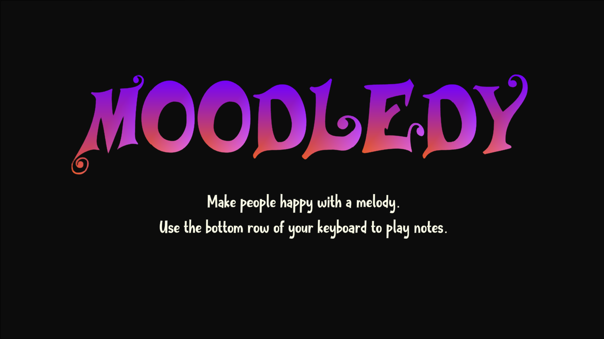

# Moodledy

Moodledy is a musical exploration game, where you can exiperiment with the effects that different melodies have on a person's mood.

[Play](https://playabledesign.itch.io/moodledy/)

---

This game was built as an entry to the [**Pacifist Game Jam 2022](https://itch.io/jam/honest-jam-4)**.

---

### Collaborators

- [Ben Poland]([polandbjamin · GitHub](https://github.com/polandbjamin))

- [Steve Mcilwain]([stevemcilwain (Steve Mcilwain) (github.com)](https://github.com/stevemcilwain))

### Built with

- Unity 2021.3 LTS

- Adobe Illustrator

##  [Attributions](ATTRIBUTIONS.md)
